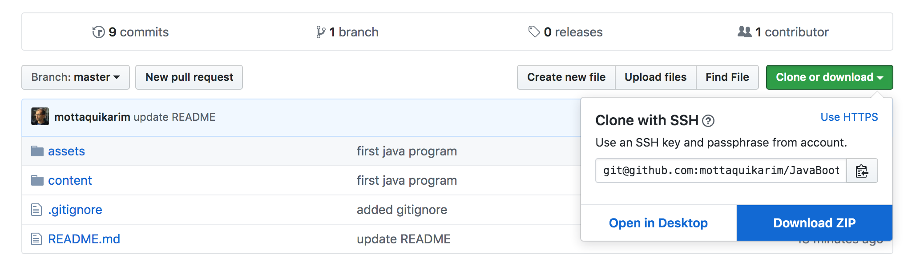

  

# Java Bootcamp 
🎉🎈🎂🍾🎊🍻💃

*A hands on and practical introduction
 to programming and java development.*

## Learning Objectives

* Key terms and terminology regarding the web tech ecosystem 
	* (stuff like the meaning of "servers", 'database", "APIs", etc)
* Basics of programming and how to think programmatically
* Basics of java the language
* Building small terminal programs in Java

## Using this Document

Please keep this page open in your browser as we navigate through this lecture. If you'd like, you may also **bookmark** this particular page as it will be maintained for as long as I teach this course in the future.

**Crucially**, please download the `.zip` version of this repository as it contains code examples that you will be expected to complete as part of class today. Please refer to the image below for how to download the zipped version of this repo.

## [Class Notes](https://repl.it/@mottaquikarim/JAVA-Bootcamp-6292019) ⬅️⬅️

## Table of Contents
*We will break this bootcamp up into a few sections -- and hopefully we can work through all the sections listed below!*

### [1. How does IG Work?](content/how_does_ig_work/README.md)
### [2. Essential Terminology](content/essential_terminology/README.md)
### [3. What is Java?](content/what_is_java/README.md)
### [4. Our First Java Program](content/our_first_java_program/README.md)
### [5. Setting Up Our Environment](content/setting_up_our_environment/README.md)
### [6. Basic Data Types](content/basic_data_types/README.md)
### [7. Command Line Basics](content/command_line_basics/README.md)
### [8. Control Flow](content/control_flow/README.md)
### [9. Loops](content/loops/README.md)
### [10. Classes](content/classes/README.md)

## Class Recap: May 4th 2019

*Class notes and recap items will be found here!*

**[Java Ex](https://github.com/mottaquikarim/JavaBootcamp/tree/master/recaps/May042019)**

## Taq Karim
 

[Hello, Wrold!](https://medium.com/@the_taqquikarim/console-log-hello-wrold-3e3abeb44396) I'm Taq, Tech Lead of the Demand Side (DSP) team at Place Exchange, a programmatic advertising exchange platform for Out of Home media. I'm also a lecturer, leading workshops and courses on a wide variety of topics (frontend / backend) in institutions such as Coalition 4 Queens (now Pursuit), The Startup Institute, NYCDA, OneMonth, The King's College and Columbia Splash. [I've taught Front-end Web Development at GA 14x](https://medium.com/@the_taqquikarim/10-lessons-learned-from-100-weeks-of-teaching-fewd-12c43db14f6b) (so far). When I'm not working I am usually [thinking about math](https://medium.com/math-musings/why-does-25-25-2-2-1-100-25-an-explanation-6c7e7b283d41), [building](https://medium.com/@the_taqquikarim/a-technique-for-saving-content-from-a-data-text-html-uri-10f045a8876d) [software](https://medium.com/@the_taqquikarim/introducing-bonfire-2c0e437895e2), [working](https://photos.app.goo.gl/w1crzgI7DqCgGR373) [on](https://photos.app.goo.gl/EaFkp5SmyO0opkg32) [hardware](https://photos.app.goo.gl/tvxPl2zbIMl7FEnK2) [hacks](https://www.instagram.com/p/8rARZNND_t/?taken-by=taqqui.karim) or hanging out with my cat, Layla Karim.

